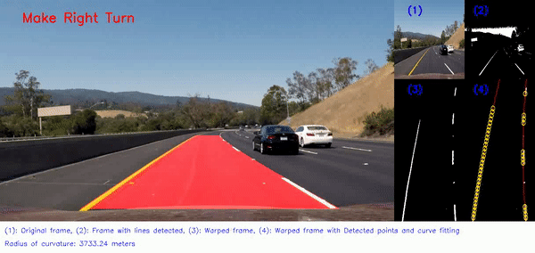

<h1 style="text-align: center;">Lane Detection and Turn Prediction for Self Driving Cars</h1>

Vision based perception is a fundamental aspect of navigation with Autonomous Mobile Robots, self driving cars being one of its applications. For any good self-driving car, the first and foremost task would be to detect lanes on the road. This detection will help with localizing the car primarily and this information will help drive the car, make turns as necessary and do everything that comes along with it. It is quite literally the eyes of the car. <br>

Here we are provided with two video datasets and we perform lane detection first of all and then in the second video we also integrate it with turn prediction based on the radius of curvature of the road.

## Pipeline to perform Lane Detection
1. Create a capture object and capture the image frame by frame
2. Convert it to grayscale, and apply Gaussian blur
3. Detect edges using cv.Canny edge detector
4. Select a region of interest (triangular in this case)
5. First we detect only solid lines
6. Using cv.HoughLinesP and setting minium length very high to eliminate small lines to
detect only solid lines
7. Average out the beginning and end coordinates of the line to get single coordinates of
beginning and end points
8. Find its slope and intercept
9. Using the slope and intercept to fit the entire frame along the line and finding new extreme
points
10. Using these extreme lines to draw a green line denoting a solid line
11. Now to detect only dashed lines
12. Using cv.HoughLinesP to detect all lines
13. Using step 8, we have the slope of solid lines
14. If slope of solid lines is positive only save those lines whose slope is negative (denotes
dashed line)
15. If slope of solid lines is negative only save those lines whose slope is positive (denotes
dashed line)
16. Average out the beginning and end coordinates of the line to get single coordinates of
beginning and end points
17. Find its slope and intercept
18. Using the slope and intercept to fit the entire frame along the line and finding new extreme
points
19. Using these extreme lines to draw a red line denoting a dashed line

## Output: Lanes Detected
<p align="center">
     

<br>


## Pipeline to perform Turn Prediction
1. Create a capture object and capture the image frame by frame
2. Convert to grayscale and threshold the image
3. Create a three channel threshold to show in final output
4. Using cv.findHomography and cv.warpPerspective perform homography of a selected
region of the frame and warp its perspective
5. Convert the warped perspective image into a grayscale, threshold it and convert it to a three
channel threshold to perform further operation
6. The orginal three channel threshold from step 5 will be added to the final output, we make a
copy of it for futher processing
7. Creating a blank image like the warped image
8. First we detect the lane with white colour
9. Convert the warped image into grayscale and threshold it
10. Using np.where find the coordinates of pixels whose values are 255 which correspond to
white pixels
11. Using np.polyfit fit a polynomial curve of degree 2 on these points
12. Find out the x and y coordinates of points aloing the curve and make it into an array
13. Using cv.polylines draw the curve on a.) blank image & b.) copy of the warped three
channel threshold image
14. Using cv.circle draw circles along the detected points for the white line
15. Calculate the radius of curvature of white lane
16. Next, we detect the lane with yellow colour
17. Convert the image into the HSV domain to get only yellow lines
18. Using np.where find the coordinates of pixels whose values are 255 which correspond to
yellow pixels
19. Using np.polyfit fit a polynomial curve of degree 2 on these points
20. Find out the x and y coordinates of points aloing the curve and make it into an array
21. Using cv.polylines draw the curve on a.) blank image & b.) copy of the warped three
channel threshold image
22. Using cv.circle draw circles along the detected points for the yellow line
23. Calculate the radius of curvature of yellow lane
24. Take average of both the radii of curvatures to get the radius of curvature of the road
25. Using cv.fillPoly, fill the area between both the lanes i.e the road into red
26. Perform inverse homography and inverse warp perspective to put all the detected lines and
plots and overlay using cv.add to the original frame
27. Based on the curvature predict the turn of the road
28. Put all the necessary outputs into smaller windows and create a frame of multiple outputs
29. Annotate each window with necessary window names and mention them and also the radius
of curvature of the road

## Output: Turn Prediction
<p align="center">
     

<br>


## Usage
* Clone the repo to your local machine
```
git clone https://github.com/HemanthJoseph/Lane-Detection-with-Turn-Prediction-for-Self-Driving.git
```
* Change Directory
```
cd src
```
* Run the python file
```
python Image_Stitching.py
```

## Dependencies and libraries
1. Python 3.9.12
2. OpenCV '4.7.0'
3. Numpy '1.24.2'
